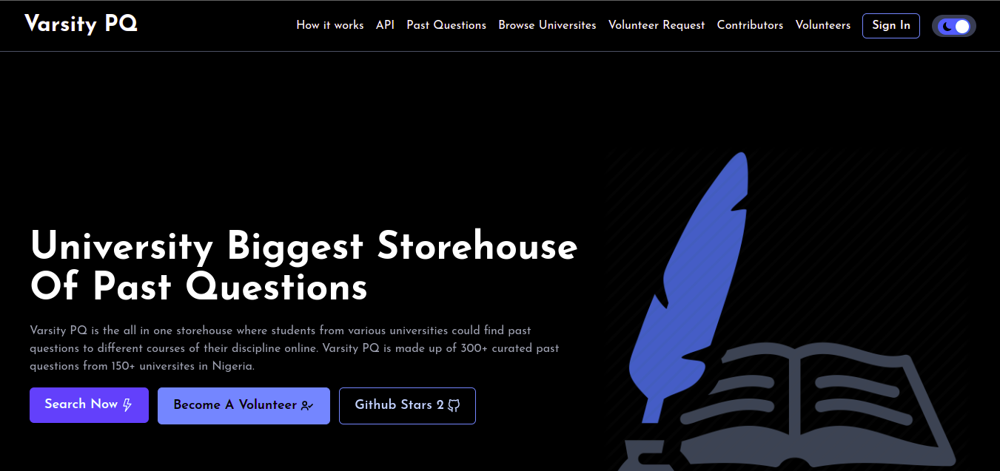

<p align="center">
  <a href="https://varsitypq.com/">
    
  </a>
</p>
<h4 align="center">Store House of 300+ past questions</h4>

<p align="center">
<a href="https://github.com/curlyzik/varsity-pq-frontend/blob/master/LICENSE" target="blank">

</a>
<a href="https://github.com/curlyzik/varsity-pq-frontend/fork" target="blank">

</a>
<a href="https://github.com/curlyzik/varsity-pq-frontend/stargazers" target="blank">

</a>
<a href="https://github.com/curlyzik/varsity-pq-frontend/issues" target="blank">

</a>
<a href="https://github.com/curlyzik/varsity-pq-frontend/pulls" target="blank">

</a>
</p>

<p align="center"></p>

<p align="center">
    <a href="https://varsitypq.com/" target="blank">Website</a>
    ·
    <a href="https://github.com/curlyzik/varsity-pq-frontend/issues/new/choose">Report Bug</a>
    ·
    <a href="https://github.com/curlyzik/varsity-pq-frontend/issues/new/choose">Request Feature</a>
</p>

### Introducing Varsity PQ ✌️

Varsity PQ is the all in one storehouse where students from various universities in Nigeria could find past questions to different courses of their discipline online. Varsity PQ is made up of over 300+ curated past questions from 160+ universites in Nigeria.

<!-- [Read about us to understand better 📖](https://varsitypq.com/about-us) -->

## 🚀 Varsity PQ

<a href="https://varsitypq.com/" target="blank">

</a>

Start Searching: [Varsity PQ](https://varsitypq.com/)

## 🧐 Features

Varsity PQ is a curated storehouse of past questions from various universities in Nigeria and has some nice features to help you find the right past question for your course.

> Varsity PQ features

- 💯 **300+ Past Questions**
- 🎩 **Filter by Federal University**
- 👾 **Filter by State University**
- 🔖 **Filter by Private University**
- 📦 **Become a Volunteer**
- 📦 **Volunteer Dashboard**
- 📦 **Create Courses and Past Questions**
- 💻 **Fully Responsive**
- 🍭 **Api Endpoints**
- 🌘 **Dark mode**

Varsity PQ is the revolutionary app where Nigerian students can find past questions to different courses of their discipline online✨️

<!-- ## 🛠️ Contributing, Installation Steps

1. Fork and Clone the repository

Fork the [repository](https://github.com/curlyzik/varsity-pq-frontend) first and then clone it.

2. Follow the [Contributing and Installation Steps](https://github.com/curlyzik/varsity-pq-backend) of the backend repository

3. Change the working directory

```bash
cd varsity-pq-frontend
```

4. Install dependencies

```bash
npm install
```

5. Create `.env` file in root and add your variables

```bash
NEXT_PUBLIC_RAPIDAPI_KEY=

NEXT_PUBLIC_NEWS_API_HOST=google-search3.p.rapidapi.com
NEXT_PUBLIC_NEWS_API_URL=https://google-search3.p.rapidapi.com/api/v1

NEXT_PUBLIC_UNIVERSITY_API_HOST=nigeria-universites.p.rapidapi.com
NEXT_PUBLIC_UNIVERSITY_API_URL=https://nigeria-universites.p.rapidapi.com

NEXT_PUBLIC_PQ_API_HOST=nigeria-university-past-questions.p.rapidapi.com
NEXT_PUBLIC_PQ_API_URL=https://nigeria-university-past-questions.p.rapidapi.com


NEXT_PUBLIC_EMAILJS_SERVICE_ID=
NEXT_PUBLIC_EMAILJS_TEMPLATE_ID=
NEXT_PUBLIC_EMAILJS_USER_ID=

NEXT_PUBLIC_API_URL=http://localhost:8000
```

5. Run the app

```bash
npm run dev
```

You are all set! Open [localhost:3000](http://localhost:3000/) to see the app. -->

## 💻 Built with

- [Next JS](https://nextjs.org/)
- [Ant Design](https://ant.design): ui framework for building dashboard
- [Email Js](https://harperdb.io/): Send Email Directly From JavaScript
- [Tailwind](https://tailwindcss.com/): source for complete styling
 [Axios](https://www.npmjs.com/package/axios): for data fetching
- [Axios Auto Refresh](https://www.npmjs.com/package/axios-auth-refresh): for automatic refresh of jwt token
- [Redux Toolkit](https://redux-toolkit.js.org/): for global state management
- [Redux Persist](https://www.npmjs.com/package/redux-persist): Persist and rehydrate a redux store.
- [React-PDF](https://www.npmjs.com/package/react-pdf): Display PDFs in your React app as easily as if they were images.
- [Animate.css](https://animate.style/): for smooth Animations
- [AOS](https://michalsnik.github.io/aos/): for scroll animations
- [React Icons](https://react-icons.github.io/react-icons): for icons

- [Vercel](http://vercel.com/): for hosting
[react-infinite-scroll-component](https://github.com/ankeetmaini/react-infinite-scroll-component): for infinite scrolling
- [react-ripples](https://github.com/rwu823/react-ripples): for ripple effects

## 🌈 What's next

Varsity PQ is the biggest project I have made till date and I have big ideas in my mind, and you can see a lot more features coming soon.

Here are some idea that is coming really soon 👀

- Volunteers Page **In Progress ⏳️**
- Contributors Page **In Progress ⏳️**
- PWA, **In Progress ⏳️**
- Upload Past Qeustions as Images
- AMP Support, **In Progress ⏳️**
- Hear description for posts, **In Progress ⏳️**
## 🛡️ License

This project is licensed under the MIT License - see the [`LICENSE`](LICENSE) file for details.

## 👨‍💻 Author

### 👤 Isaac Nzekwe

- Twitter: [@curlyzik](https://twitter.com/curlyzik)
- Github: [@curlyzik](https://github.com/curlyzik)
- LinkedIn: [@nzekwe-isaac](https://www.linkedin.com/in/nzekwe-isaac/)

<!-- ## 💪 Thanks to the all Contributors

Thanks a lot for spending your time in helping Varsity PQ grow and help many developers. Thanks a lot! Keep rocking 🍻

Also, check them on [varsitypq.com/contributors](https://varsitypq.com/contributors) -->

## 🙏 Support

This project needs a ⭐️ from you. Please don't forget to leave a star ⭐️

If you found the app helpful, consider supporting me with a coffee.

<a href="https://www.buymeacoffee.com/curlyzik" target="_blank"></a>
---

<h3 align="center">
Varsity PQ needs a ⭐️ from you
</h3>
